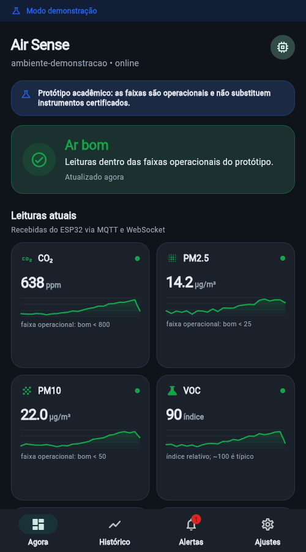

# Air Sense Mobile

Aplicativo Flutter do projeto Air Sense para acompanhar, no celular, a estação
de qualidade do ar baseada em ESP32 ESP-WROOM-32. Esta implementação substitui
o rascunho incompleto exportado do FlutterFlow por um cliente compilável,
responsivo e conectado diretamente ao backend presente em `dashboard/backend`.



## O que já funciona

- descoberta e seleção de dispositivos expostos pelo backend;
- painel em tempo real por WebSocket, com reconexão exponencial;
- atualização de contingência pela API REST;
- histórico de CO₂, PM2.5, PM10, VOC, temperatura e umidade;
- alertas locais derivados das leituras, com reconhecimento e limite de ruído;
- detalhes de firmware, RSSI, sensores, heap e tempo ligado;
- página técnica com o mapa físico informado da placa ESP-WROOM-32;
- persistência local da URL, tema e preferência de alertas;
- temas claro/escuro e layout adaptável;
- ícones e splash próprios para Android, iOS e Web;
- modo demonstração explícito, sem confundir dados simulados com dados reais;
- suporte a Android, iOS e Web a partir da mesma base.

O aplicativo é deliberadamente somente leitura. Operações críticas como
calibração remota, reinício ou OTA ficam desabilitadas até que o backend tenha
autenticação, autorização, auditoria e confirmação segura.

## Execução rápida

Pré-requisitos: Flutter estável compatível com Dart 3.12 ou superior e, para
Android/iOS, a cadeia de compilação da plataforma.

```bash
cd mobile
flutter pub get
flutter run
```

Na primeira abertura, informe a URL do backend:

- Android Emulator: `http://10.0.2.2:3001`;
- celular físico: `http://IP_DO_COMPUTADOR:3001`;
- iOS Simulator ou Web local: `http://localhost:3001`.

O computador e o celular físico devem estar na mesma rede. O backend precisa
escutar fora do loopback (`BIND_ADDRESS=0.0.0.0`) e o firewall deve liberar a
porta somente para a rede confiável.

Também é possível fixar a URL durante o build:

```bash
flutter run --dart-define=API_BASE_URL=http://192.168.1.20:3001
```

Para avaliar todas as telas sem hardware ou backend:

```bash
flutter run --dart-define=AIR_SENSE_DEMO=true
```

O modo demonstração exibe uma faixa azul permanente e nunca é apresentado como
telemetria real.

## Backend local

Na raiz do repositório, suba a pilha conforme o README principal:

```bash
docker compose up --build
```

Antes de abrir o app, valide no navegador:

```text
http://localhost:3001/api/health
```

O cliente usa os endpoints abaixo, sem Firebase:

| Transporte | Recurso | Uso |
|---|---|---|
| REST | `/api/health` | prontidão do backend, MQTT e persistência |
| REST | `/api/metricas` | contadores de ingestão |
| REST | `/api/dispositivos` | dispositivos e última amostra |
| REST | `/api/dispositivos/:id/serie` | séries históricas |
| WebSocket | `/ws` | telemetria em tempo real |

No Android e iOS não há política CORS do navegador. Para executar a variante Web
em uma origem diferente da API, configure um reverse proxy de mesma origem ou
habilite CORS no backend com uma lista explícita de origens; não use `*` quando
houver autenticação.

## Build

```bash
flutter analyze
flutter test
flutter build apk --release
flutter build web --release
```

O build Android de desenvolvimento é imediatamente instalável. Para distribuir
um release, copie `android/key.properties.example` para `android/key.properties`,
aponte `storeFile` para um keystore protegido e substitua os valores de exemplo.
Esses arquivos estão ignorados pelo Git. Sem essa configuração, o build release
usa a assinatura de depuração somente para facilitar o piloto local e não deve
ser enviado à loja.

Para uma API HTTPS de produção:

```bash
flutter build apk --release \
  --dart-define=API_BASE_URL=https://api.exemplo.com
```

Android permite HTTP local para desenvolvimento. Produção deve usar HTTPS/WSS e
remover ou restringir a exceção de cleartext. No iOS foi habilitado apenas o
acesso à rede local; endpoints externos continuam sujeitos às regras normais de
segurança de transporte.

## Estrutura

```text
lib/
├── app.dart                    bootstrap, tema e roteamento inicial
├── core/app_theme.dart         identidade visual compartilhada com a web
├── data/                       REST e preferências locais
├── models/                     contrato, métricas, alertas e verdictos
├── pages/                      sete fluxos principais do aplicativo
├── state/app_controller.dart   estado, polling, WebSocket e demonstração
└── widgets/common_widgets.dart componentes visuais reutilizáveis e gráficos
```

Documentação complementar:

- [`docs/ARQUITETURA_MOBILE.md`](docs/ARQUITETURA_MOBILE.md);
- [`docs/FLUTTERFLOW_MIGRACAO.md`](docs/FLUTTERFLOW_MIGRACAO.md);
- [`docs/ROADMAP_MOBILE.md`](docs/ROADMAP_MOBILE.md).

## Limitações assumidas

- alertas persistentes, push em segundo plano e contas de usuário ainda exigem
  serviços autenticados no backend;
- os limites visuais são referências operacionais do protótipo, não normas de
  segurança nem laudos de saúde;
- a pinagem da página de hardware reproduz a serigrafia informada e deve ser
  conferida no exemplar físico antes de elaborar placa ou chicote;
- comandos AWS IoT, Cognito e push estão planejados, mas não são simulados como
  se já estivessem disponíveis.
