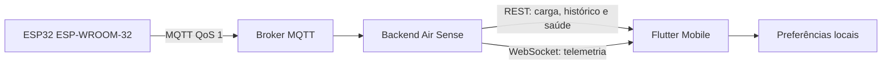

# Arquitetura do aplicativo mobile

## Objetivo

Entregar uma interface móvel útil com o backend atual, mantendo baixo acoplamento
e deixando explícita a fronteira entre o que existe hoje e integrações futuras.
O cliente não replica regras críticas do firmware: ele interpreta o contrato,
apresenta dados e mantém apenas estado de interface.

## Fluxo de dados

O `AppController` é o coordenador da sessão. Ele recebe uma abstração de API e
uma abstração de preferências, o que permite teste sem rede ou armazenamento
real. Nenhuma tela acessa HTTP diretamente.

## Inicialização e conexão

1. O aplicativo carrega URL, tema, alertas e modo salvo.
2. Sem configuração, abre o portal de conexão.
3. A URL é validada e `/api/health`, `/api/dispositivos` e `/api/metricas` são
   consultados antes de confirmar a configuração.
4. O WebSocket é aberto em `/ws`.
5. Em queda do socket, a interface continua com a última amostra e o polling
   REST; a reconexão usa intervalos de 2, 4, 8, 16 e 30 segundos.
6. A cada 30 segundos a carga REST reconcilia estado online e métricas.

## Memória e desempenho

- histórico em memória limitado a 2.000 pontos por campo;
- alertas da sessão limitados a 100;
- uma instância compartilhada de `http.Client` por conexão;
- gráficos desenhados com `CustomPainter`, evitando bibliotecas pesadas;
- `IndexedStack` conserva o estado de rolagem das quatro abas principais;
- telemetria inválida no socket é descartada sem derrubar a sessão;
- imagens e fontes remotas não são necessárias para abrir o app.

Essas decisões reduzem dependências e tamanho do cliente. As restrições de heap
do ESP32 permanecem tratadas no firmware; o celular nunca solicita ao
microcontrolador séries completas nem arquivos grandes.

## Segurança

- a URL informada é persistida, mas nenhuma senha ou certificado é salvo nesta
  versão;
- HTTP é aceito apenas para a rede local de desenvolvimento;
- o aplicativo atual é somente leitura;
- uma futura ação remota deve passar pelo backend autenticado, nunca acessar o
  ESP32 diretamente;
- certificados ou tokens não devem ser adicionados ao repositório nem embutidos
  em `--dart-define`;
- em AWS, use Cognito/OIDC no usuário, endpoint HTTPS/WSS e políticas por escopo.

## Testabilidade

`SettingsStore` possui implementação em memória, e `AirSenseApiClient` aceita um
`http.Client` injetado. Os testes cobrem parsing do contrato, regras de qualidade,
formação de URLs, leitura da lista de dispositivos e os fluxos visuais inicial e
de demonstração.
