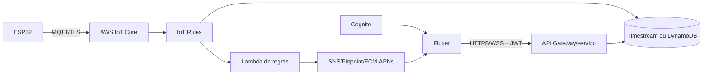

# Roadmap do aplicativo mobile

## Marco M0 — base funcional local (concluído)

- [x] projeto Flutter Android/iOS/Web;
- [x] tema alinhado ao dashboard web;
- [x] sete páginas migradas do blueprint FlutterFlow;
- [x] API REST, WebSocket e reconexão;
- [x] modo demonstração identificado;
- [x] preferências locais, modo escuro e seleção de dispositivo;
- [x] histórico, alertas da sessão e diagnóstico do dispositivo;
- [x] testes unitários, de integração de cliente e de widget.

Critério de aceite: o app abre sem conta, conecta ao backend do repositório e
exibe uma amostra real ou informa de modo acionável por que não conseguiu.

## Marco M1 — piloto em rede local

- [ ] validar Android físico em pelo menos dois fabricantes;
- [ ] validar iPhone físico e permissão de rede local;
- [ ] testar rotação, fontes grandes, leitor de tela e contraste;
- [ ] ensaio de desconexão/reconexão por 24 horas;
- [ ] medir consumo de bateria com app em primeiro plano;
- [ ] registrar screenshots de todas as páginas em claro e escuro;
- [x] substituir ícones padrão de launcher por ativos consistentes da marca.

Critério de aceite: zero crash, reconexão automática e leitura compreensível em
celulares pequenos durante um piloto contínuo de 24 horas.

## Marco M2 — contas, alertas persistentes e AWS

Arquitetura sugerida:

- [ ] definir tenants, usuários, funções e escopos;
- [ ] Cognito/OIDC com fluxo PKCE e armazenamento seguro de tokens;
- [ ] API versionada com paginação, filtros e idempotência;
- [ ] alertas persistidos no servidor, com estado e auditoria;
- [ ] push notification por FCM/APNs acionado pelo backend;
- [ ] política IoT por dispositivo, certificados rotacionáveis e revogação;
- [ ] telemetria histórica com retenção, custo e exportação definidos;
- [ ] observabilidade, orçamento, alarmes de custo e ambientes separados.

Critério de aceite: um usuário só acessa seus locais; push funciona com o app
fechado; cada reconhecimento de alerta é auditável.

## Marco M3 — operação de hardware autorizada

- [ ] contrato de comandos assinado, versionado e idempotente;
- [ ] fila de comandos com expiração, correlação e confirmação do dispositivo;
- [ ] calibração com papel autorizado e presença física confirmada;
- [ ] OTA assinada, partição de rollback e anel de implantação;
- [ ] tela de progresso que diferencia solicitado, entregue, aplicado e falhou;
- [ ] trilha imutável de operador, motivo, versão e resultado;
- [ ] botão de cancelamento quando a operação permitir.

Critério de aceite: nenhuma ação perigosa acontece por toque acidental, perda de
rede, repetição de mensagem ou usuário sem autorização.

## Marco M4 — publicação

- [ ] identificadores, nomes, ícones, splash e política de privacidade finais;
- [ ] assinatura Android/iOS fora do repositório;
- [ ] flavors `dev`, `staging` e `prod`;
- [ ] CI para format, analyze, test e builds assináveis;
- [ ] testes fechados nas lojas e canal de feedback;
- [ ] monitoramento de crashes sem incluir telemetria sensível;
- [ ] plano de suporte, compatibilidade mínima e descontinuação.

Critério de aceite: builds reproduzíveis, revisão de privacidade concluída e
rollback de versão documentado.
